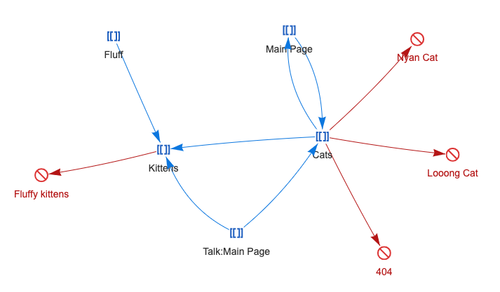

# Network

[](https://github.com/ProfessionalWiki/Network/actions?query=workflow%3ACI)
[](https://packagist.org/packages/professional-wiki/network)
[](https://packagist.org/packages/professional-wiki/network)

The **Network** extension allows visualizing connections between wiki pages via an interactive network graph.

It was created by [Professional.Wiki](https://professional.wiki/) and funded by
[KDZ - Centre for Public Administration Research](https://www.kdz.eu/).

<a href="https://raw.githubusercontent.com/ProfessionalWiki/Network/master/.github/network.png"></a>
<a href="https://www.youtube.com/watch?v=iI1zJ8ma474&feature=youtu.be&t=1"></a>

- [Platform requirements](#platform-requirements)
- [Installation](#installation)
- [Usage](#usage)
  * [Parameters](#parameters)
  * [Layout CSS](#layout-css)
  * [Configuration](#configuration)
  * [Examples](#examples)
    + [Options parameter](#options-parameter)
    + [Using templates](#using-templates)
- [Limitations](#limitations)
- [Contribution and support](#contribution-and-support)
- [Development](#development)
- [License](#license)
- [Release notes](#release-notes)

## Platform requirements

* PHP 7.3 or later
* MediaWiki 1.31.x up to 1.35.x

See the [release notes](#release-notes) for more information on the different versions of Network.

## Installation

The recommended way to install Network is using [Composer](https://getcomposer.org) with
[MediaWiki's built-in support for Composer](https://professional.wiki/en/articles/installing-mediawiki-extensions-with-composer).

On the commandline, go to your wikis root directory. Then run these two commands:

```shell script
COMPOSER=composer.local.json composer require --no-update professional-wiki/network:~1.3
composer update professional-wiki/network --no-dev -o
```

Then enable the extension by adding the following to the bottom of your wikis `LocalSettings.php` file:

```php
wfLoadExtension( 'Network' );
```

You can verify the extension was enabled successfully by opening your wikis Special:Version page in your browser.

Finally, please consider [sponsoring the project].

## Usage

Minimal example

```
{{#network:}}
```

Example with parameters

```
{{#network:Page1 | Page2 | Page3
 | class = col-lg-3 mt-0
 | exclude = Main Page ; Sitemap
}}
```

### Parameters

<table>
    <tr>
        <th></th>
        <th>Default</th>
        <th>Example value</th>
        <th>Description</th>
    </tr>
    <tr>
        <th>(page or pages)</th>
        <td><i>The current page</i></td>
        <td>MyPage</td>
        <td>The name of the page to show connections for. Can be specified multiple times. The parameter name is optional. Templates are supported</td>
    </tr>
    <tr>
        <th>class</th>
        <td></td>
        <td>col-lg-3 mt-0</td>
        <td>Extra css class(es) to add to the network graph</td>
    </tr>
    <tr>
        <th>exclude</th>
        <td></td>
        <td>Sitemap ; Main Page</td>
        <td>Pages to exclude from the network graph, separated by semicolon</td>
    </tr>
    <tr>
        <th>options</th>
        <td></td>
        <td>{ "nodes": { "shape": "box" } }</td>
        <td>
            <a href="https://visjs.github.io/vis-network/docs/network/#options">vis.js options</a> in JSON.
            Option names and text values both need to be surrounded with double quotes.
            Single quotes will not work. Tailing commas also do not work. Two curly brackets closes the parser function,
            so if you are putting the JSON directly in the parser function rather than using a template, put a tailing space
            or new line after each closing bracket.
        </td>
    </tr>
</table>

### Layout CSS

The network graphs are located in a div with class `network-visualization`. The default css for this class is

```css
.network-visualization {
    width: 100%;
    height: 600px;
}
```

You can add extra CSS in [MediaWiki:Common.css]. You can also add extra classes to the div via the `class` parameter.

### Configuration

The default value of all parameters can be changed by placing configuration in "LocalSettings.php".
These configuration settings are available:

* `$wgPageNetworkOptions` – options passed directly to the graph visualization library
* `$wgPageNetworkExcludeTalkPages` - indicates if talk pages should be excluded
* `$wgPageNetworkExcludedNamespaces` - IDs of namespaces to exclude

Default values of these configuration settings can be found in "extension.json". Do not change "extension.json".

**$wgPageNetworkOptions**

Array of [vis.js options](https://visjs.github.io/vis-network/docs/network/#options). Can be (partially) overridden per network via the `options` parameter

Example:

```php
$wgPageNetworkOptions = [
    'clickToUse' => true,
    'nodes' => [
        'borderWidth' => 1,
        'borderWidthSelected' => 2,
        'shape' => 'box',
    ],
];
```

	private function registerEditApiModuleFallbacks() {
	}
Note: to change the width or height, use CSS, not the network options.

**$wgPageNetworkExcludeTalkPages**

Possible values: `true`, `false`

Default value: `true` (talk pages get excluded)

**$wgPageNetworkExcludedNamespaces**

List of IDs of namespaces of which all pages should be excluded.

Default value: `[ 2, 4, 8, 12 ]` (excluding `User`, `Project`, `MediaWiki` and `Help`)

Example: `$wgPageNetworkExcludedNamespaces = [ NS_USER, NS_PROJECT ];`

See also: https://www.mediawiki.org/wiki/Manual:Namespace#Built-in_namespaces

### Examples

#### Options parameter

Array of [vis.js options](https://visjs.github.io/vis-network/docs/network/#options)

```
{{#network:Page1 | Page2 | Page3
 | options=
{
    "autoResize": true,
    "nodes": {
        "color": "lightblue",
        "shape": "box",
        "borderWidth": 3,
        "font": { "color": "red", "size": 17 }
    }
}
}}
```

Wrong: `"font.color": "red"`, right: `"font": { "color": "red" }`, also right: `"font": "14 px arial red"` 

#### Using templates

```
{{#network: {{NetworkPages}}
 | class = col-lg-3 mt-0
 | options= {{NetworkOptions}}
}}
```

Where `NetworkPages` contains `Page1 | Page2 | Page3` and `NetworkOptions` contains `{ "nodes": { "shape": "box" } } `

## Performance / caching

This extension bypasses the MediaWiki page cache. This means that your network graphs will always be up to date,
without needing to purge the page cache.

## Limitations

* External links are not shown
* Node labels cannot be changed. They are always the full page name
* Styling or grouping per category or namespace is not supported

Pull requests to remove those limitations are welcome.

You can also contact [Professional.Wiki](https://professional.wiki/)
for [Professional MediaWiki development](https://professional.wiki/en/mediawiki-development) services.

## Contribution and support

If you want to contribute work to the project please subscribe to the developers mailing list and
have a look at the contribution guideline.

* [File an issue](https://github.com/ProfessionalWiki/Network/issues)
* [Submit a pull request](https://github.com/ProfessionalWiki/Network/pulls)
* Ask a question on [the mailing list](https://www.semantic-mediawiki.org/wiki/Mailing_list)

[Professional MediaWiki support](https://professional.wiki/en/support) is available via
[Professional.Wiki](https://professional.wiki/).

## Development

Tests, style checks and static analysis can be run via Make. You can execute these commands on the command line
in the `extensions/Network` directory:

* `make ci` - run everything
* `make cs` - run style checks
* `make test` - run the tests 

For more details see the `Makefile`.

The JavaScript tests can only be run by going to the [`Special:JavaScriptTest` page][JS tests].

## License

[GNU General Public License v2.0 or later (GPL-2.0-or-later)](/COPYING).

## Professional Support and Development

[Professional.Wiki] provides commercial [MediaWiki development], [managed wiki hosting] and [MediaWiki support].

## Release notes

### Version 1.4.0

Released on January 9, 2021.

* Upgraded viz-network from 8.3.2 to 8.5.5

### Version 1.3.0

Released on September 8, 2020.

* Added WAI compliance by adding an aria-label attribute to the network canvas

### Version 1.2.1

Released on September 7, 2020.

* Added compatibility with MediaWiki 1.31

### Version 1.2.0

Released on September 7, 2020.

* Upgraded viz-network from 7.6 to 8.3

### Version 1.1.1

Released on September 7, 2020.

* Made code more robust against invalid titles

### Version 1.1.0

Released on August 30, 2020.

* Added `$wgPageNetworkExcludeTalkPages` option
* Added `$wgPageNetworkExcludedNamespaces` option
* Improved node repulsion physics

### Version 1.0.0

Released on August 11, 2020.

Initial release

[MediaWiki:Common.css]: https://www.mediawiki.org/wiki/Manual:Interface/Stylesheets
[JS tests]: https://www.mediawiki.org/wiki/Manual:JavaScript_unit_testing
[sponsoring the project]: https://github.com/sponsors/JeroenDeDauw
[Professional.Wiki]: https://professional.wiki
[MediaWiki development]: https://professional.wiki/en/mediawiki-development
[managed wiki hosting]: https://professional.wiki/en/hosting
[MediaWiki support]: https://professional.wiki/en/support
